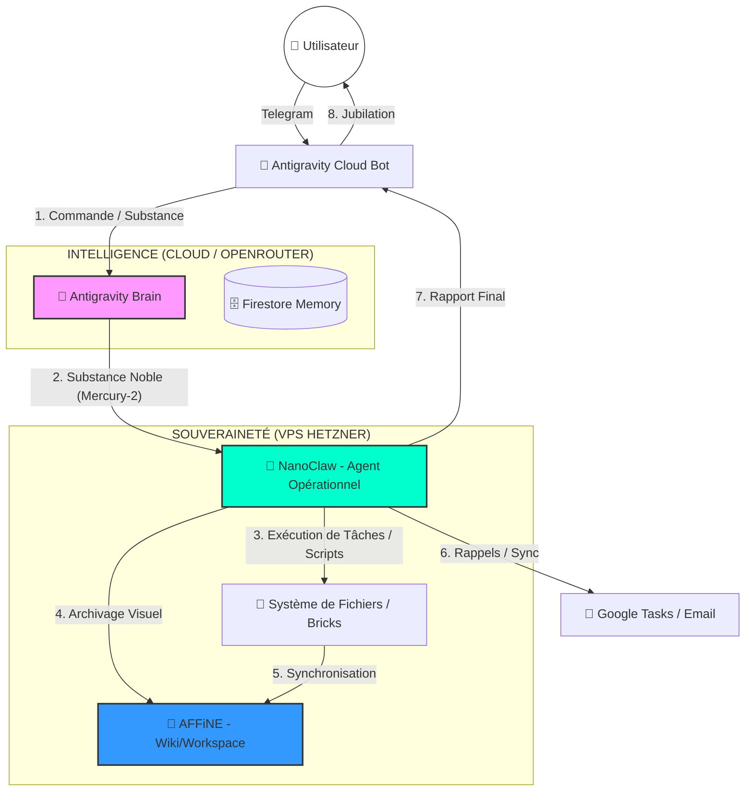

# 🌪️ Workflow Antigravity v3.0 : L'Écosystème Souverain

Ce document visualise l'intégration de **NanoClaw** (Action) et **AFFiNE** (Structure) au sein de l'architecture **Antigravity Brain** (Substance).

## 🗺️ Visualisation du Flux (Diagramme Mermaid)

## ⚙️ Détail des Rôles

### 1. Telegram (L'Interface de Commande)
*   **Rôle** : Terminal de contrôle mobile et vocal.
*   **Flux** : Envoi de texte, audio, vidéo et réception des rapports de substance.

### 2. Antigravity Brain (Le Stratège)
*   **Rôle** : Définit la **Substance**.
*   **Action** : Analyse l'intention, gère les paliers de mémoire (Shaving), et sélectionne les briques KLEIA-UP. Il donne les instructions de haut niveau à NanoClaw.

### 3. NanoClaw (L'Exécutant Souverain)
*   **Rôle** : L'agent tactile sur le VPS.
*   **Action** : 
    *   **Analyse Multimodale** : Télécharge et traite les vidéos/audios.
    *   **Codage** : Écrit et exécute les scripts Python/Bash en container sécurisé.
    *   **Orchestration** : Envoie les tâches à Google Tasks ou archive dans AFFiNE.

### 4. AFFiNE (La Bibliothèque Visuelle)
*   **Rôle** : Le **Second Cerveau Permanent**.
*   **Action** : Visualise les "Bricks" de connaissance. Permet de passer du texte (Wiki) au dessin (Whiteboard) pour le design de nouveaux concepts.

---

## 💎 Scénario Type : De l'intuition à l'action

1.  **Input** : Vous envoyez un audio de 5 min sur Telegram à 8h du matin.
2.  **Cerveau** : Antigravity Brain identifie 3 concepts stratégiques (Mercury-2).
3.  **Action** : NanoClaw transcrit l'audio, génère un rapport de 10 points.
4.  **Structure** : NanoClaw crée une page dans **AFFiNE** avec le rapport et programme 2 rappels dans **Google Tasks** pour l'après-midi.
5.  **Output** : Vous recevez sur Telegram : *"Substance extraite. Page créée dans AFFiNE. Rappels programmés. Tout est prêt."*

> [!TIP]
> Cette architecture permet d'utiliser la puissance du Cloud pour le raisonnement tout en gardant vos actifs et vos exécutions dans votre propre "forteresse" (Le VPS Hetzner).
